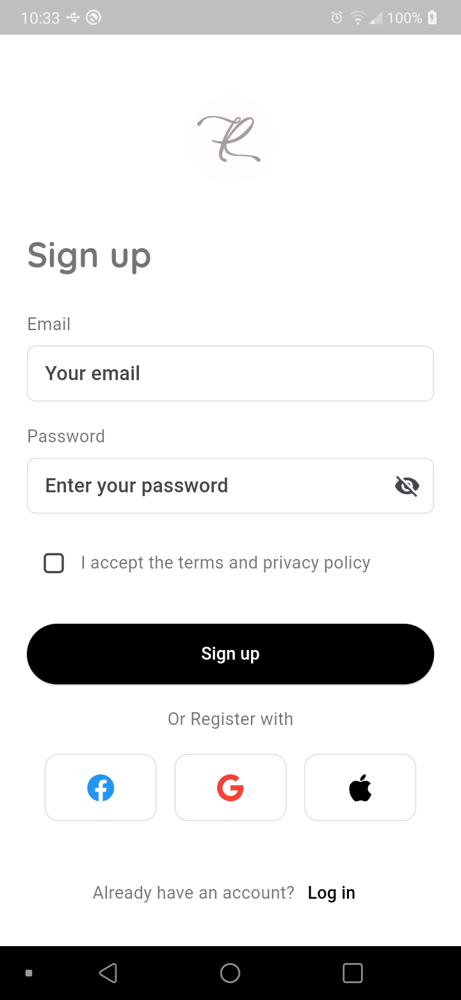
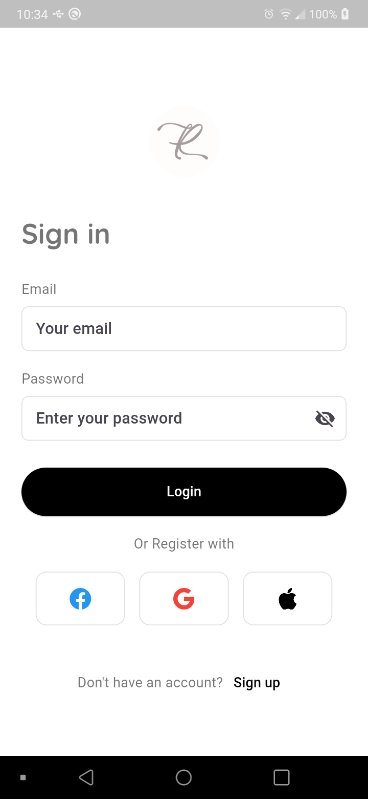

# Login App

A Flutter application for user authentication, providing an intuitive and modern interface for signing up and signing in.

## Features

- **User Registration**: Users can create new accounts with email and password.
- **User Login**: Existing users can log in to their accounts easily.
- **Social Media Integration**: Sign up or log in using Facebook, Google, or Apple accounts.
- **Real-time Validation**: Input fields for email and password include real-time validation to ensure correct data entry.
- **Custom Widgets**: Reusable components for a clean and organized codebase.

## Screenshots

### Sign Up Screen
&nbsp;

### Sign In Screen


## Getting Started

To get started with this project, follow these steps:

1. **Clone the Repository**
   ```bash
   git clone https://github.com/yourusername/login.git
   cd login


### Instruções para Uso


- Se precisar de mais informações ou detalhes específicos sobre o projeto, sinta-se à vontade para adicionar ou modificar as seções conforme necessário.

Se você tiver mais alguma dúvida ou precisar de ajuda com outra parte do projeto, é só avisar!
