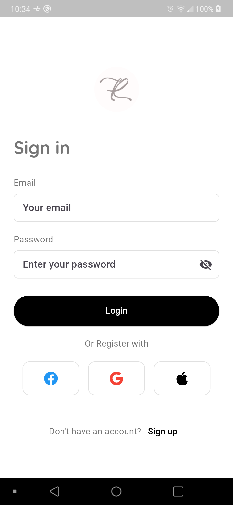

# Login App

**Select Language:**  
[🇬🇧 English](README.md) | [🇧🇷 Português](READMEBR.md) | [🇪🇸 Español](READMEES.md)

Um aplicativo Flutter para autenticação de usuários, oferecendo uma interface intuitiva e moderna para cadastro e login.

## Recursos

- **Registro de Usuário**: Usuários podem criar novas contas com email e senha.
- **Login de Usuário**: Usuários existentes podem acessar suas contas facilmente.
- **Integração com Mídias Sociais**: Cadastre-se ou faça login usando contas do Facebook, Google ou Apple.
- **Validação em Tempo Real**: Os campos de entrada para email e senha incluem validação em tempo real para garantir a entrada de dados correta.
- **Widgets Personalizados**: Componentes reutilizáveis para um código limpo e organizado.

## Capturas de Tela

### Tela de Cadastro
 

### Tela de Login


## Começando

Para começar com este projeto, siga estas etapas:

1. **Clone o Repositório**
   ```bash
   git clone https://github.com/regyfelipe/Login_Register.git
   cd login


### Instruções para Uso

- Se precisar de mais informações ou detalhes específicos sobre o projeto, sinta-se à vontade para adicionar ou modificar as seções conforme necessário.

Se você tiver mais alguma dúvida ou precisar de ajuda com outra parte do projeto, é só avisar!